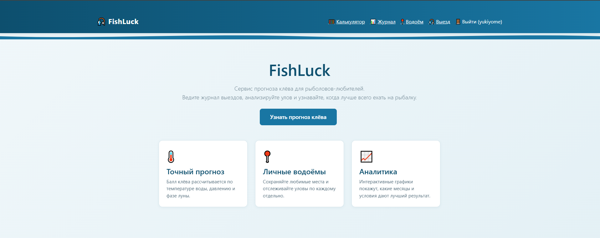
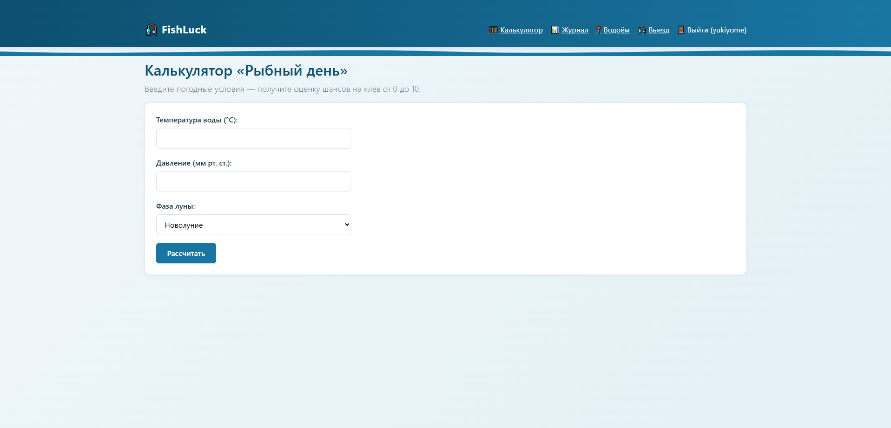
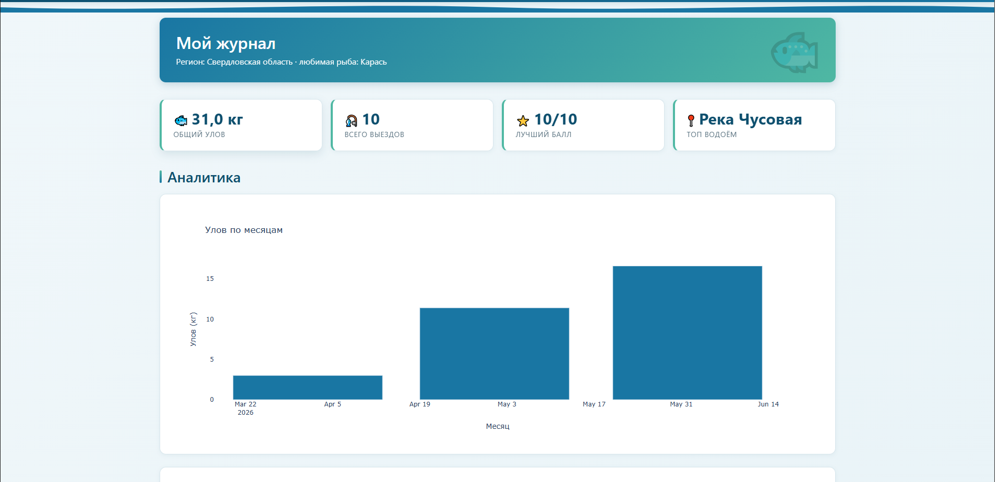
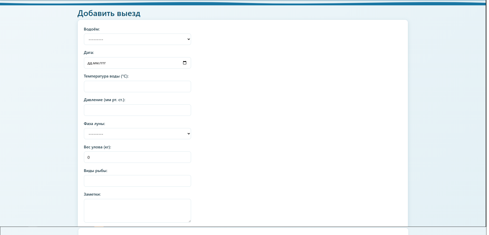

# 🎣 FishLuck

Сервис прогноза клёва для рыболовов-любителей с журналом водоёмов, выездов и автоматическим расчётом коэффициента активности рыбы.

**Публичная версия:** [cellbaker.pythonanywhere.com](https://cellbaker.pythonanywhere.com)

---

## Скриншоты

### Главная


### Калькулятор «Рыбного дня»


### Аналитический дашборд


### Добавление выезда


---

## Возможности

- 🧮 **Калькулятор «Рыбного дня»** — оценка шансов на клёв от 0 до 10 на основе температуры воды, атмосферного давления и фазы луны. Доступен без регистрации.
- 📍 **Журнал водоёмов** — каждый пользователь ведёт список своих мест с типом водоёма и целевой рыбой.
- 🎣 **Журнал выездов** — фиксация даты, погодных условий, фазы луны и фактического улова. Балл клёва считается автоматически.
- 📊 **Аналитический дашборд** — KPI-плитки и интерактивные графики на Pandas + Plotly:
  - улов по месяцам;
  - средний улов по водоёмам;
  - корреляция прогноза клёва с реальным уловом;
  - распределение улова по фазам луны;
  - сводная таблица статистики.
- 🔐 **Регистрация и авторизация** пользователей с разделением личных данных.
- 🎨 **Тематический дизайн** — собственный CSS-слой поверх Bootstrap 5 с морской палитрой, анимациями и адаптивной вёрсткой.

---

## Технологический стек

- **Backend:** Python 3.10+, Django 5.2
- **Database:** SQLite
- **Аналитика:** Pandas, Plotly
- **Frontend:** Bootstrap 5 + кастомный CSS
- **Deploy:** PythonAnywhere
- **VCS:** Git, GitHub

---

## Структура моделей

Три связанные кастомные модели:

- **Angler** — профиль рыболова (привязан к `User`, регион, любимая рыба).
- **FishingSpot** — водоём (`ForeignKey` → Angler; название, тип, целевая рыба).
- **FishingTrip** — выезд (`ForeignKey` → Angler и FishingSpot; дата, температура воды, давление, фаза луны, улов).

Модель `FishingTrip` содержит вычисляемые свойства `bite_score` (балл клёва 0–10) и `score_color` (цветовая категория).

---

## Локальный запуск

```bash
# 1. Клонировать репозиторий
git clone https://github.com/yukiiyome/Fishluck.git
cd Fishluck

# 2. Создать виртуальное окружение
python -m venv venv
# Windows:
.\venv\Scripts\Activate.ps1
# Linux/macOS:
source venv/bin/activate

# 3. Установить зависимости
pip install -r requirements.txt

# 4. Применить миграции
python manage.py migrate

# 5. Создать суперпользователя
python manage.py createsuperuser

# 6. (опционально) Наполнить тестовыми данными
python manage.py seed_data <username>

# 7. Запустить сервер
python manage.py runserver
```

Сайт будет доступен по адресу http://127.0.0.1:8000/

## Автор
Хайбулин Артём Евгеньевич
